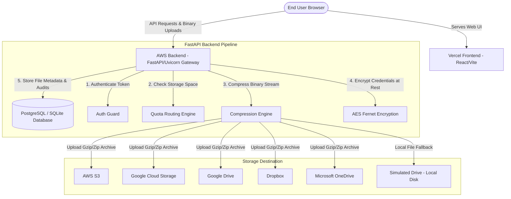

# CIRRUS — Smart Multi-Cloud Storage Pooling & Compression Dashboard

CIRRUS is a modern, premium multi-cloud storage manager that aggregates disconnected cloud storage accounts (such as AWS S3, Google Cloud Storage, Google Drive, OneDrive, and Dropbox) into a single, unified virtual disk space. 

It dynamically routes files to the provider with the most available space (Smart Quota Routing) and compresses files on-the-fly (GZIP/ZIP compression engine) to optimize storage utilization, displaying real-time compression metrics and savings. The application is styled with a custom high-fidelity dark glassmorphic design.

---

## 🏗️ System Architecture



---

## 📁 Modules Breakdown

The project is clean, decoupled, and split into frontend and backend components.

### 🐍 Backend Modules (`backend/`)

*   **[main.py](file:///c:/Users/sanan/OneDrive/Desktop/cirrus/backend/main.py)**: The main entry point for the FastAPI server. Contains setup for CORS, middleware routing, and the core endpoints (Auth, Accounts, Files, Folders, Logs, Stats). Defines the compression and dynamic upload-routing orchestrator.
*   **[storage_clients.py](file:///c:/Users/sanan/OneDrive/Desktop/cirrus/backend/storage_clients.py)**: Client abstraction layer (`StorageProviderClient`) containing concrete class drivers for communicating with cloud SDKs/APIs:
    *   `S3StorageClient` (Boto3 integration)
    *   `GCSStorageClient` (Google Cloud Storage integration)
    *   `GoogleDriveStorageClient` (Google Drive OAuth client API)
    *   `OneDriveStorageClient` (Microsoft Graph API client)
    *   `DropboxStorageClient` (Dropbox HTTP API driver)
    *   `MockStorageClient` (Simulated local storage folder driver)
*   **[database.py](file:///c:/Users/sanan/OneDrive/Desktop/cirrus/backend/database.py)**: SQLAlchemy configuration. Supports local SQLite connection by default and standard PostgreSQL drivers for production.
*   **[models.py](file:///c:/Users/sanan/OneDrive/Desktop/cirrus/backend/models.py)**: SQLAlchemy declarative schemas defining the database tables.
*   **[schemas.py](file:///c:/Users/sanan/OneDrive/Desktop/cirrus/backend/schemas.py)**: Pydantic schemas enforcing strict request validation and response serialization.
*   **[crypto_utils.py](file:///c:/Users/sanan/OneDrive/Desktop/cirrus/backend/crypto_utils.py)**: Cryptographic utility layer:
    *   Symmetric encryption (AES Fernet) for encrypting cloud access credentials at-rest in the DB.
    *   Password Hashing (PBKDF2-HMAC-SHA256 with random salt).
    *   JSON Web Token (JWT) encoding/decoding for stateless user authentication.
*   **[oauth_routes.py](file:///c:/Users/sanan/OneDrive/Desktop/cirrus/backend/oauth_routes.py)**: Implements the OAuth 2.0 Authorization Code flow for Google Drive, Dropbox, and OneDrive. Manages authorization redirects and callback handlers to securely request and capture long-lived refresh tokens.
*   **[browser_drive.py](file:///c:/Users/sanan/OneDrive/Desktop/cirrus/backend/browser_drive.py)**: Optional browser automation pipeline using Playwright to handle connection/sign-in flows that require automation.

### ⚛️ Frontend Components (`frontend/src/`)

*   **[App.jsx](file:///c:/Users/sanan/OneDrive/Desktop/cirrus/frontend/src/App.jsx)**: Root container coordinate. Stores session state (JWT authentication, folders lists, active files) and manages API interactions.
*   **[index.css](file:///c:/Users/sanan/OneDrive/Desktop/cirrus/frontend/src/index.css)**: Master style sheet housing CSS custom variables defining the Dark Glassmorphic Theme system (gradients, backdrops, transitions, shadows, and glowing accent rings).
*   **[components/Sidebar.jsx](file:///c:/Users/sanan/OneDrive/Desktop/cirrus/frontend/src/components/Sidebar.jsx)**: Vertical navigation layout containing routing tabs and user log-out actions.
*   **[components/Dashboard.jsx](file:///c:/Users/sanan/OneDrive/Desktop/cirrus/frontend/src/components/Dashboard.jsx)**: Analytics hub showcasing overall quota stats, file counts, compression efficiency, space savings meters, and system audit logs.
*   **[components/AccountsManager.jsx](file:///c:/Users/sanan/OneDrive/Desktop/cirrus/frontend/src/components/AccountsManager.jsx)**: Portal to connect new storage drives. Supports linking live cloud accounts (inputting credentials or starting OAuth callbacks) and launching Mock simulation drives.
*   **[components/FileManager.jsx](file:///c:/Users/sanan/OneDrive/Desktop/cirrus/frontend/src/components/FileManager.jsx)**: File Explorer layout supporting drag-and-drop uploads, folder creation, compression mode selectors (None, Gzip, Zip), search, downloads, and deletions.

---

## 🗄️ Database Models Schema

The system uses 5 key database entities:

### 1. `User` (Table: `users`)
| Column | Type | Description |
|---|---|---|
| `id` | VARCHAR (PK) | Unique User UUID |
| `email` | VARCHAR (Unique) | User login email address |
| `hashed_password` | VARCHAR | PBKDF2 secure password hash |
| `full_name` | VARCHAR | User's display name |
| `created_at` | DATETIME | Timestamp of registration |

### 2. `StorageAccount` (Table: `storage_accounts`)
| Column | Type | Description |
|---|---|---|
| `id` | VARCHAR (PK) | Unique Storage Account UUID |
| `user_id` | VARCHAR (FK) | Reference to owning user |
| `provider` | VARCHAR | Provider type (`s3`, `gdrive`, `dropbox`, `onedrive`, `gcs`, `mock`) |
| `display_name` | VARCHAR | Custom identifier name (e.g. "Backup Dropbox") |
| `credentials_json` | TEXT | Encrypted JSON containing access keys, secret keys, or OAuth refresh tokens |
| `quota_limit` | BIGINT | Maximum storage capacity in bytes |
| `used_space` | BIGINT | Calculated used storage in bytes |
| `is_mock` | BOOLEAN | Indicates if drive is running in simulated mock mode |
| `is_active` | BOOLEAN | Indicates if connection is online/enabled |

### 3. `Folder` (Table: `folders`)
| Column | Type | Description |
|---|---|---|
| `id` | VARCHAR (PK) | Unique Virtual Folder UUID |
| `user_id` | VARCHAR (FK) | Reference to owning user |
| `name` | VARCHAR | Folder display label |
| `parent_id` | VARCHAR (FK) | Recursive self-reference key for nested subfolders |

### 4. `StoredFile` (Table: `stored_files`)
| Column | Type | Description |
|---|---|---|
| `id` | VARCHAR (PK) | Unique Stored File UUID |
| `user_id` | VARCHAR (FK) | Reference to owning user |
| `account_id` | VARCHAR (FK) | Reference to target `StorageAccount` hosting the file |
| `folder_id` | VARCHAR (FK) | Reference to parenting virtual `Folder` metadata |
| `original_name` | VARCHAR | Source filename before compression |
| `stored_name` | VARCHAR | Cloud identifier key/ID of uploaded object |
| `compression_type` | VARCHAR | Format used (`none`, `gzip`, `zip`) |
| `original_size` | BIGINT | Raw uncompressed file size in bytes |
| `compressed_size` | BIGINT | Real archive size stored on cloud drive |
| `cloud_provider` | VARCHAR | String representation of host provider |
| `web_link` | VARCHAR | Direct external cloud link (if supported) |
| `upload_time` | DATETIME | Date of upload |

### 5. `AuditLog` (Table: `audit_logs`)
| Column | Type | Description |
|---|---|---|
| `id` | INTEGER (PK) | Auto-incrementing primary key |
| `user_id` | VARCHAR (FK) | Reference to logging user |
| `action` | VARCHAR | Action name (e.g., `SIGNUP`, `LOGIN`, `UPLOAD`, `DOWNLOAD`) |
| `details` | VARCHAR | Summary log string |
| `timestamp` | DATETIME | Time of action |

---

## 🌐 API Endpoint Reference

All routes require a valid authorization header formatted as: `Authorization: Bearer <jwt-token>` (excluding signup/login/OAuth callbacks).

### 🔑 Authentication Routes
*   `POST /api/auth/signup`: Create a new user account.
    *   **Body**: `{ "email": "user@example.com", "password": "securepassword", "full_name": "John Doe" }`
    *   **Response**: Returns access JWT token and User object.
*   `POST /api/auth/login`: Authenticate existing credentials.
    *   **Body**: `{ "email": "user@example.com", "password": "securepassword" }`
    *   **Response**: Returns access JWT token and User object.
*   `GET /api/logs`: Fetch recent audit logs for the authenticated session.

### 💾 Cloud Storage Accounts
*   `GET /api/accounts`: List connected accounts (automatically queries each provider API to update active `used_space` capacities).
*   `POST /api/accounts`: Create a storage account connection metadata mapping.
*   `POST /api/accounts/{account_id}/login`: Launch interactive sign-in workflows (Playwright).
*   `DELETE /api/accounts/{account_id}`: Purge cloud account configuration, delete mock data, and erase encrypted credentials from the database.

### 📁 Virtual Folders
*   `GET /api/folders`: List virtual folders matching user.
*   `POST /api/folders`: Create a virtual directory folder.
*   `DELETE /api/folders/{folder_id}`: Remove empty virtual directory.

### 📄 File Management
*   `GET /api/files`: List metadata records for all files.
*   `POST /api/upload`: Multi-part form upload pipeline.
    *   **Form fields**: `file` (binary), `compression` (`gzip` | `zip` | `none`), `folder_id` (optional).
    *   **Pipeline**: Selects active drive with the most capacity → Copies file to memory cache → Runs compression → Uploads resulting package → Commits file metadata → Wipes local cache.
*   `GET /api/download/{file_id}`: Decompression download gateway.
    *   **Pipeline**: Fetches file metadata → Downloads compressed archive from host provider to memory cache → Decompresses archive to original state → Streams binary payload directly to browser → Flushes cache.
*   `DELETE /api/files/{file_id}`: Delete file from both database registry and destination cloud repository.

### 📊 Dashboard Statistics
*   `GET /api/stats`: Calculates aggregated metrics (total file registries, aggregate uncompressed vs compressed byte size, total space savings percentage, provider allocation counts, and updated account lists).

### 🔌 OAuth Connections
*   `GET /api/oauth/providers`: Check which integrations are supported and configured on the server.
*   `GET /api/oauth/{provider}/start`: Initiates OAuth authorization redirection sequence.
*   `GET /api/oauth/{provider}/callback`: Callback listener endpoints. Trades code query parameters for refresh tokens, gets provider user email/quota limits, encrypts tokens, and stores connected account details.

---

## ⚙️ How to Setup and Run Locally

### 1. Backend API Setup

1.  Navigate into the `backend/` folder:
    ```bash
    cd backend
    ```
2.  Set up a virtual environment:
    ```bash
    python -m venv venv
    source venv/Scripts/activate  # On macOS/Linux use: source venv/bin/activate
    ```
3.  Install python dependencies:
    ```bash
    pip install -r requirements.txt
    ```
4.  Generate a secure 32-byte Fernet key for your credentials encryption:
    ```bash
    python -c "from cryptography.fernet import Fernet; print(Fernet.generate_key().decode())"
    ```
5.  Create a `.env` environment variables file:
    ```env
    # DB URL (local SQLite database default)
    DATABASE_URL=sqlite:///./cirrus.db
    
    # Encryption & JWT keys (generate secure secrets)
    CIRRUS_SECRET_KEY=YOUR_GENERATED_32_BYTE_FERNET_KEY
    CIRRUS_JWT_SECRET=YOUR_SECURE_JWT_SIGNING_SECRET_KEY
    
    # Base URL of the API gateway (used in OAuth redirects)
    CIRRUS_BACKEND_URL=http://localhost:8000
    ```
6.  *(Optional)* Create `oauth_secrets.json` to enable OAuth connections locally (Copy the example layout):
    ```bash
    cp oauth_secrets.example.json oauth_secrets.json
    ```
    Paste client IDs and client secrets generated in Google Cloud, Microsoft Azure, and Dropbox Developer Consoles.
7.  Run the API server:
    ```bash
    uvicorn main:app --reload --port 8000
    ```

### 2. Frontend React Setup

1.  Open a new terminal inside the `frontend/` folder:
    ```bash
    cd frontend
    ```
2.  Install packages:
    ```bash
    npm install
    ```
3.  Launch the Vite development server:
    ```bash
    npm run dev
    ```
4.  Open the application interface at: `http://localhost:5173`.

---

## 🛡️ Production Security Recommendations

1.  **Configure JWT Expirations**: Set tight expirations and refresh rotations for production sessions.
2.  **CORS White-listing**: In `main.py`, replace `allow_origins=["*"]` with explicit domain origins of your hosted frontend environment.
3.  **Credential Rotations**: Periodically rotate the `CIRRUS_SECRET_KEY` Fernet variables used for database credential encryption.
