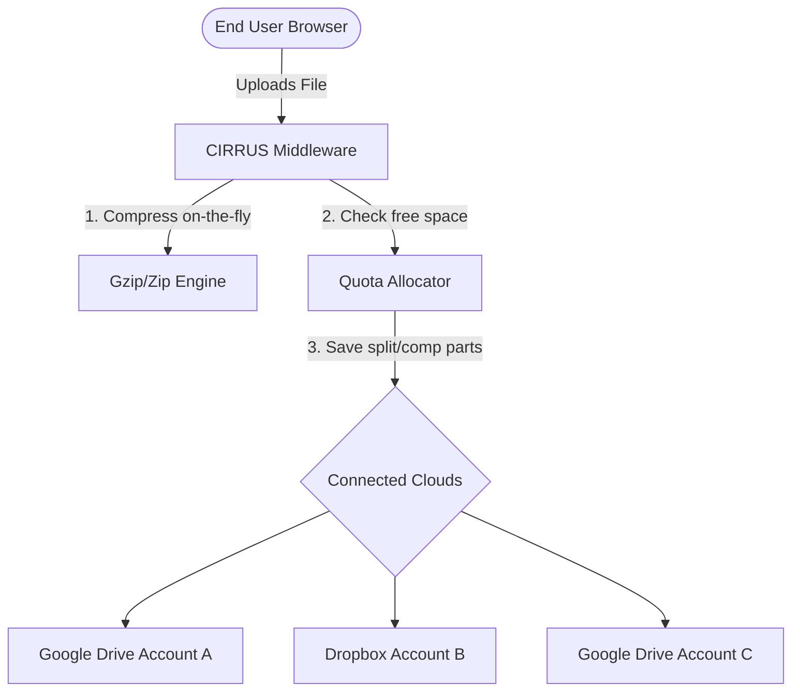

# CIRRUS — Smart Cloud Quota Pooling & Compression

> **Stop buying expensive cloud storage subscriptions.**  
> Pool your free Google Drive and Dropbox spaces into one massive, compressed, and secure virtual drive.

---

## 🚀 Key Features

### 📂 Quota Pooling
Connect multiple cloud accounts from different providers. CIRRUS calculates your aggregate storage capacity and distributes files dynamically across your connected drives based on available space.

### ⚡ Smart Compression
Choose your compression level (such as GZIP or ZIP) during upload. Your files are automatically compressed on-the-fly, saving **up to 60%+ storage space** depending on the file type.

### 🔒 Zero-Knowledge Security
- **OAuth Encrypted-at-Rest**: All access tokens and storage credentials are encrypted using AES-256-GCM before database storage.
- **Pass-through Gateway**: Files are compressed in a temporary memory-mapped cache during transit. CIRRUS **never** reads, index-scans, copies, or retains the actual contents of your files.
- **Instant Revocation**: Disconnecting an account completely purges its encrypted credentials from the database immediately.

---

## ⚙️ How it Works

1. **Sign Up / Sign In**: Register a secure account.
2. **Connect Providers**: Add your personal Google Drive or Dropbox accounts.
3. **Upload Files**: Drag & drop files. The server compresses them and automatically routes them to the provider with the most free space.
4. **Download / Share**: Retrieve and decompress files instantly with a single click.

---

## 💡 Frequently Asked Questions

### Is my file data read or stored by CIRRUS?
**No.** Your files pass through our system dynamically for compression. Once the transfer to Google Drive or Dropbox is complete, the temporary file is completely erased from our system. We do not inspect or store your files.

### What happens when I disconnect an account?
When you disconnect a cloud account, we immediately delete the encrypted OAuth credentials from our database. The files stored on that cloud account remain safe and untouched in your personal drive, and can still be accessed directly through Google or Dropbox.

### Can I connect multiple accounts of the same type?
**Yes.** You can link multiple Google Drive accounts and multiple Dropbox accounts. CIRRUS will merge all of them into your total pooled space.

---

## ⚡ Get Started

Ready to reclaim your cloud storage?

* [Sign In to CIRRUS](https://your-app-domain.com/signin)
* [Create an Account](https://your-app-domain.com/signup)
